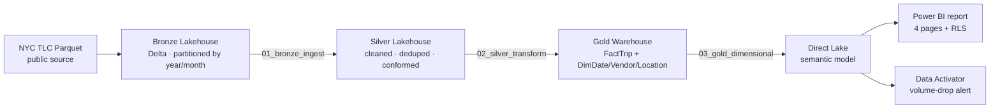

# fabric-genai-lakehouse

End-to-end Microsoft Fabric medallion lakehouse on NYC TLC trip data, with a Direct Lake semantic model, Row-Level Security, and a Data Activator alert.

> **Status:** Project 1 of 2 in this repo complete. Project 2 (a GenAI natural-language layer over the gold model) is on the roadmap — see [`/docs/roadmap.md`](docs/roadmap.md).

---

## The problem

NYC has published TLC trip data for over a decade. A typical operations question — *"which pickup zones lost the most volume month-over-month, and is the drop seasonal or structural?"* — is straightforward to ask and surprisingly hard to answer at scale. The raw parquet files are huge, schema drifts year over year, and analysts end up re-doing the same cleanup in every notebook.

This project builds the platform that answers questions like that in one place: cleaned, conformed, modeled, and queryable in Power BI with sub-second response over hundreds of millions of rows.

## Stack

`microsoft-fabric` · `power-bi` · `dax` · `pyspark` · `delta-lake` · `medallion-architecture` · `direct-lake` · `row-level-security` · `data-activator`

## Architecture

## What's in the repo

| Path | What it is |
|------|-----------|
| [`notebooks/01_bronze_ingest.ipynb`](notebooks/01_bronze_ingest.ipynb) | PySpark ingestion from public parquet to Bronze Delta tables |
| [`notebooks/02_silver_transform.ipynb`](notebooks/02_silver_transform.ipynb) | Cleanup, dedup, schema enforcement, quarantine table for invalid rows |
| [`notebooks/03_gold_dimensional.ipynb`](notebooks/03_gold_dimensional.ipynb) | Star schema build: FactTrip + DimDate, DimVendor, DimLocation |
| [`dax/measures.md`](dax/measures.md) | All 18 DAX measures with formulas and business descriptions |
| [`sql/gold_schema.sql`](sql/gold_schema.sql) | Gold Warehouse table DDL |
| [`semantic-model/`](semantic-model/) | Semantic model definition and relationship map |
| [`docs/images/`](docs/images/) | Architecture diagram and Power BI report screenshots |

## Screenshots

**Executive overview page**

**Geographic page — pickup zones by volume**

**Time trends page — YoY, QoQ, T12M**

**RLS in action — Manhattan-only view**

## How it was built

**Bronze (raw, append-only).** PySpark notebook reads monthly parquet files from the NYC TLC source, writes Delta to the Bronze Lakehouse partitioned by `year`/`month`. Audit columns `_ingested_at` and `_source_file` are added on write. Schema is preserved as-is from source — no transformation here.

**Silver (cleaned, conformed).** Null handling on required columns, dedup on trip ID, type casting, and a sanity filter that quarantines trips with negative durations or durations over 24 hours into a separate `silver_quarantine` table. Standardized categorical columns (`vendor_name`, `payment_type`, `rate_code`) using lookup joins.

**Gold (modeled).** Star schema: `FactTrip` plus `DimDate` (built from scratch with full date-intelligence support), `DimVendor` (SCD Type 1), and `DimLocation` (SCD Type 2, sourced from the TLC taxi zone lookup with effective dates). Materialized as Delta tables in the Gold Warehouse.

**Semantic model.** Direct Lake mode over the Gold Warehouse SQL endpoint. Date table marked. 18 DAX measures covering counts, ratios, time-intelligence (YoY, QoQ, trailing 12-month), and iterators (AVERAGEX over zone-trips).

**RLS.** Two roles: `Operations-All` (full access) and `Manhattan-Ops` (filtered to `DimLocation[borough] = "Manhattan"`). Validated with View As.

**Data Activator.** One rule: when daily trip count drops more than 30% versus the trailing 7-day average, fire an alert to a Teams channel.

## Key technical decisions

**Why Direct Lake over Import mode.** Import mode would force a refresh window — every model update means a multi-gigabyte transfer and a refresh failure risk. Direct Lake reads the Delta files in OneLake directly, so changes in the gold layer are queryable in seconds without a refresh. Trade-off: cold-cache queries are slower than Import, and some DAX patterns fall back to DirectQuery. For this dataset (read-mostly, large, refreshed daily) Direct Lake is the clear win.

**Why SCD Type 2 on Location but Type 1 on Vendor.** Vendor identity is stable — `vendor_id = 1` has meant Creative Mobile Technologies for years; there's no historical-truth question to preserve. Location is different: taxi zones get re-drawn, renamed, and split. To honestly answer "what did trips in this zone look like in 2022" you need the zone definition that was current in 2022, not today's.

**Why a quarantine table instead of dropping bad rows.** Silent drops hide data quality problems. Quarantining bad rows preserves them for inspection, keeps row counts reconcilable to source, and gives you a real signal — if the quarantine table starts growing, something upstream changed.

## What I learned

*(Fill in honestly, Sunday. 4–6 bullets. Examples to riff on: a Direct Lake fallback you didn't expect; a DAX measure that needed CALCULATE wrapping you didn't anticipate; a partition strategy you'd change next time; a Data Activator quirk.)*

- [TODO]
- [TODO]
- [TODO]
- [TODO]

## Run it yourself

1. Clone this repo.
2. Provision a Fabric workspace with trial capacity (F2 or higher).
3. Create three items: a Lakehouse (`bronze`), a Lakehouse (`silver`), a Warehouse (`gold`).
4. Upload the notebooks under [`/notebooks`](notebooks/) and attach them to the relevant Lakehouse.
5. Run `01_bronze_ingest.ipynb` first, then `02_silver_transform.ipynb`, then `03_gold_dimensional.ipynb`.
6. Open the Gold Warehouse → New semantic model → import the model definition from [`/semantic-model`](semantic-model/).
7. Open the `.pbix` from [`/powerbi`](powerbi/) and point it at your semantic model.

## License

MIT — see [`LICENSE`](LICENSE).

## About

Built by Guy Sigue. Senior Data Engineer / Analytics Architect.
[LinkedIn](https://linkedin.com/in/guysigue) · [GitHub](https://github.com/guysigue)
