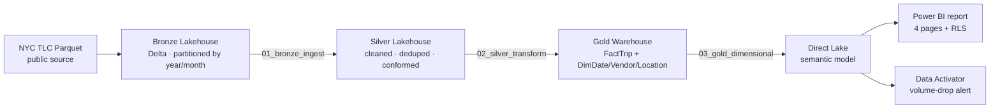
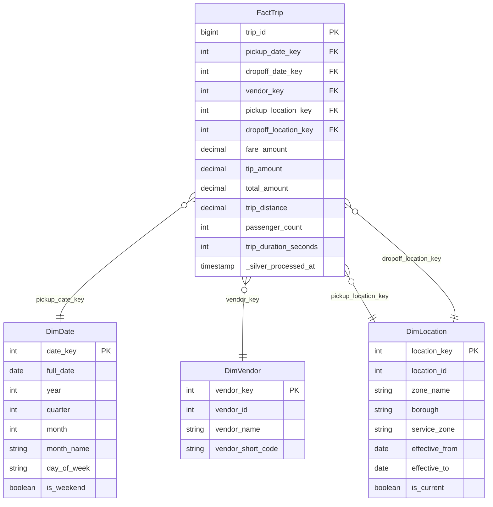
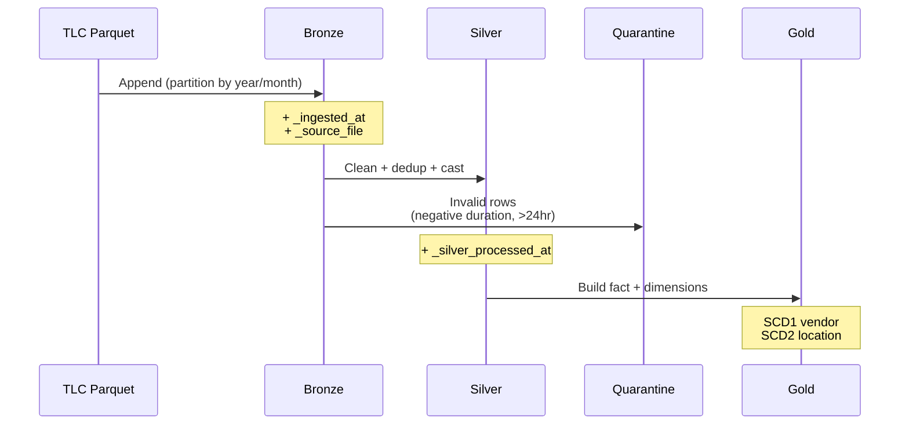

# Architecture Diagrams

## Primary architecture (medallion + serving layer)

```mermaid
flowchart LR
    A[NYC TLC Parquet<br/>public source] --> B[Bronze Lakehouse<br/>Delta · partitioned by year/month]
    B -->|01_bronze_ingest| C[Silver Lakehouse<br/>cleaned · deduped · conformed]
    C -->|02_silver_transform| D[Gold Warehouse<br/>FactTrip + DimDate/Vendor/Location]
    D -->|03_gold_dimensional| E[Direct Lake<br/>semantic model]
    E --> F[Power BI report<br/>4 pages + RLS]
    E --> G[Data Activator<br/>volume-drop alert]
```

## Star schema (gold layer)

```mermaid
erDiagram
    FactTrip }o--|| DimDate : "pickup_date_key"
    FactTrip }o--|| DimVendor : "vendor_key"
    FactTrip }o--|| DimLocation : "pickup_location_key"
    FactTrip }o--|| DimLocation : "dropoff_location_key"

    FactTrip {
        bigint trip_id PK
        int pickup_date_key FK
        int dropoff_date_key FK
        int vendor_key FK
        int pickup_location_key FK
        int dropoff_location_key FK
        decimal fare_amount
        decimal tip_amount
        decimal total_amount
        decimal trip_distance
        int passenger_count
        int trip_duration_seconds
        timestamp _silver_processed_at
    }

    DimDate {
        int date_key PK
        date full_date
        int year
        int quarter
        int month
        string month_name
        string day_of_week
        boolean is_weekend
    }

    DimVendor {
        int vendor_key PK
        int vendor_id
        string vendor_name
        string vendor_short_code
    }

    DimLocation {
        int location_key PK
        int location_id
        string zone_name
        string borough
        string service_zone
        date effective_from
        date effective_to
        boolean is_current
    }
```

## Data flow with audit columns

```mermaid
sequenceDiagram
    participant Source as TLC Parquet
    participant Bronze
    participant Silver
    participant Quarantine
    participant Gold

    Source->>Bronze: Append (partition by year/month)
    Note over Bronze: + _ingested_at<br/>+ _source_file
    Bronze->>Silver: Clean + dedup + cast
    Bronze->>Quarantine: Invalid rows<br/>(negative duration, >24hr)
    Note over Silver: + _silver_processed_at
    Silver->>Gold: Build fact + dimensions
    Note over Gold: SCD1 vendor<br/>SCD2 location
```
